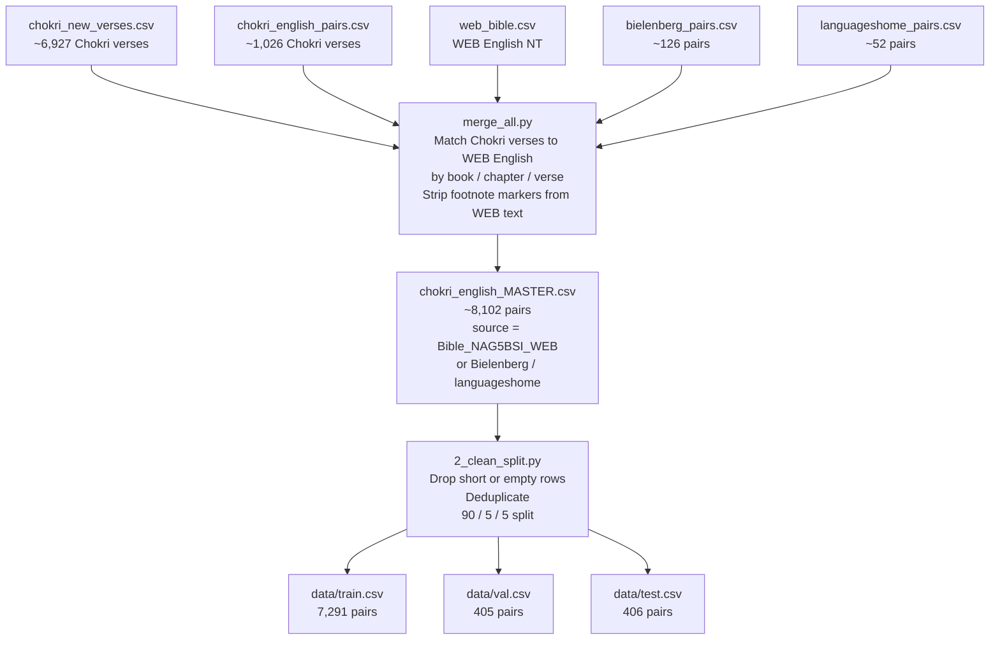
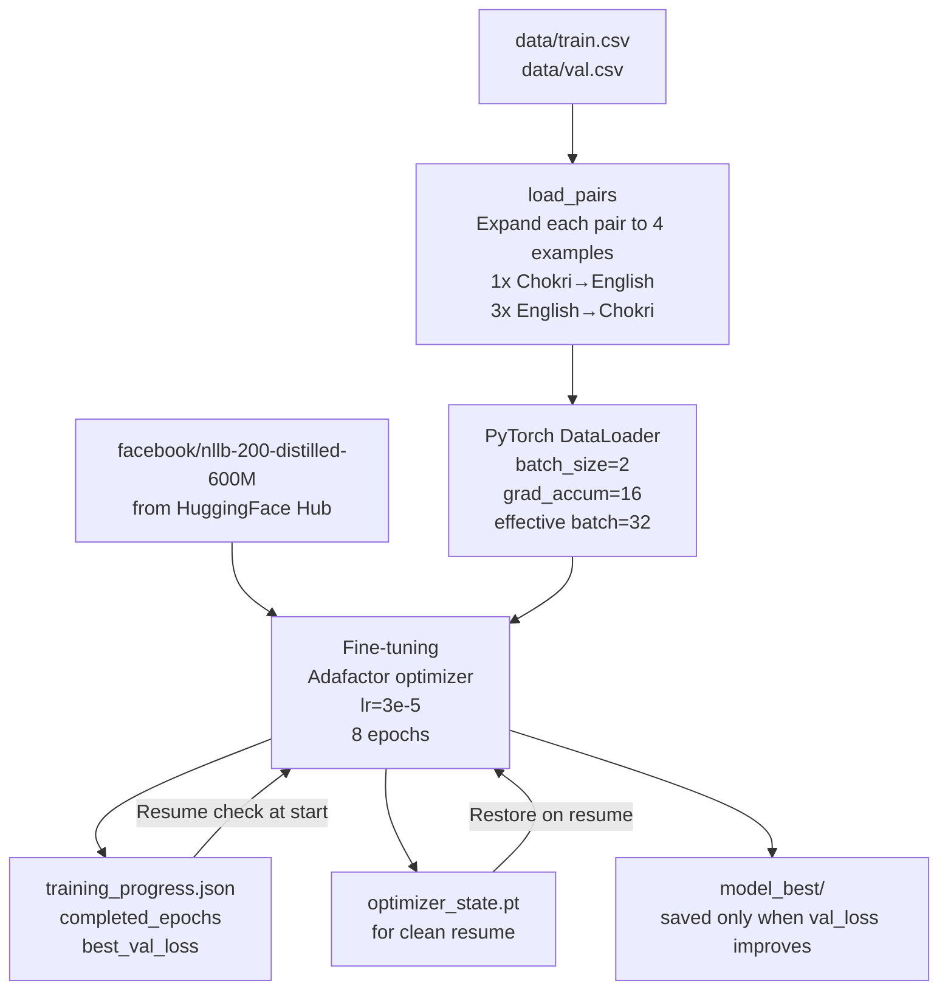
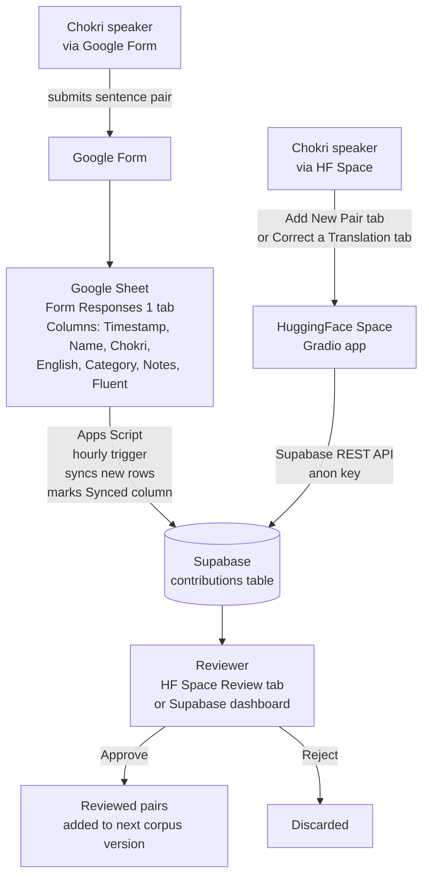
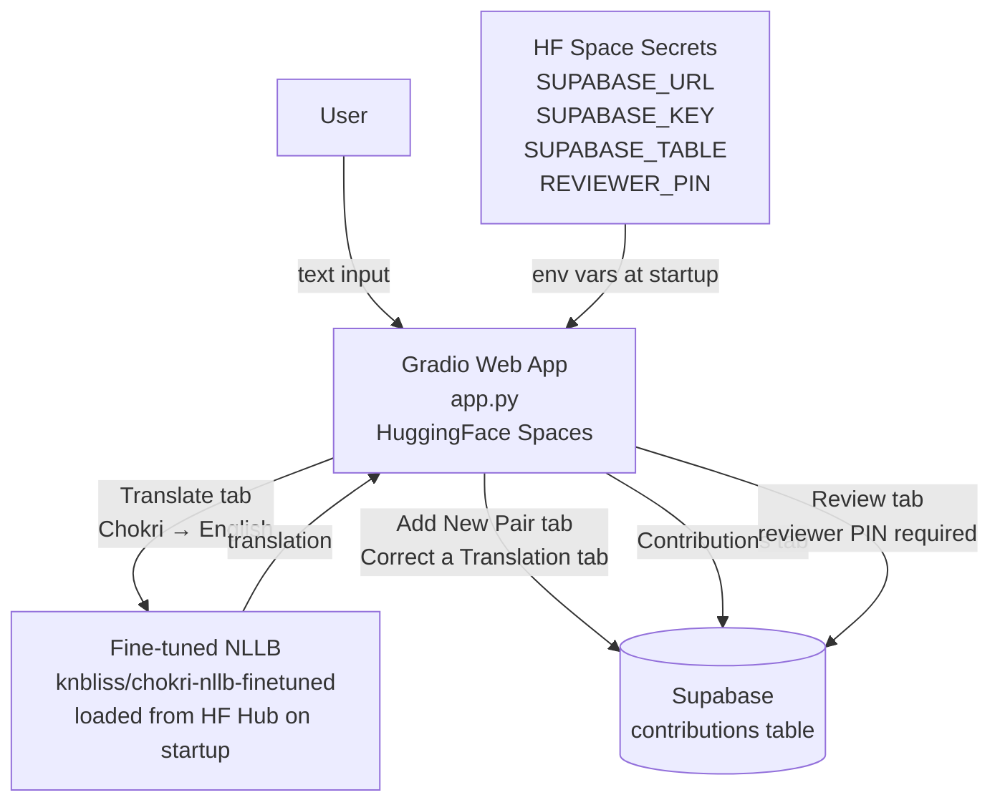
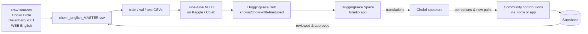

# Chokri–English Translator — System Architecture

This document describes the full architecture of the Chokri–English Neural Machine Translation system, from raw data sources through to the live web application.

---

## Overview

The system has three main components that operate independently but feed into each other:

1. **Data pipeline** — assembles and cleans the training corpus from multiple sources
2. **Training pipeline** — fine-tunes a pre-trained multilingual model on the Chokri corpus
3. **Application layer** — serves translations and collects community contributions

---

## 1. Data Pipeline

### Source files

| File | Content | Pairs |
|------|---------|-------|
| `chokri_new_verses.csv` | Chokri NT verses (scraped) | ~6,927 |
| `chokri_english_pairs.csv` | Additional Chokri verses | ~1,026 |
| `web_bible.csv` | WEB English NT (matched by verse reference) | 7,957 |
| `bielenberg_pairs.csv` | Chokri–English pairs from Bielenberg (2001) linguistics paper | ~126 |
| `languageshome_pairs.csv` | Conversational pairs from languageshome.com | ~52 |

### Build flow



### Key design decisions

- **WEB English** (World English Bible) is used instead of KJV — it is a modern, copyright-free translation without archaic language.
- WEB source text contains inline footnotes in `{curly braces}` which are stripped before training.
- The master corpus is built by matching Chokri verses to WEB verses by book/chapter/verse reference, not by using the English column already present in the Chokri CSVs (which used KJV).

---

## 2. Training Pipeline

### Model

- **Base model:** [`facebook/nllb-200-distilled-600M`](https://huggingface.co/facebook/nllb-200-distilled-600M)
- **Architecture:** Seq2Seq Transformer (encoder-decoder), 600M parameters
- **Why NLLB:** Covers 200 languages including many low-resource ones; strong multilingual representations useful for transfer learning

### Proxy token strategy

Chokri is not in NLLB's language list. Training requires a language token as a stand-in:

| Token | Language | Why |
|-------|----------|-----|
| `zho_Hant` | Traditional Chinese | ❌ Used in v1.0 — strong Chinese prior in base model caused English→Chokri to output Chinese |
| `lus_Latn` | Mizo (Lushai) | ✅ Used from v1.1 — Tibeto-Burman family, Northeast India, Latin script, weak NLLB prior |

Future plan: register `nri_Latn` (ISO 639-3 code for Chokri Naga) as a proper NLLB token.

### Direction weighting

To fix the English→Chokri direction (which was being dominated by the base model's Mizo prior), training examples are weighted 3:1 in favour of English→Chokri:

```
For each sentence pair:
  1× Chokri → English
  3× English → Chokri
```

This gives the model 4× the signal for each sentence pair, with the English→Chokri direction receiving 75% of training gradient updates.

### Training flow



### Resume logic

Every epoch writes `training_progress.json` (epoch count + best val loss) and `optimizer_state.pt`. If the session is interrupted, re-running the notebook reads these files and continues from the next epoch — loading `model_best/` as the starting weights.

### Hardware

Training runs on cloud GPU environments:

| Platform | GPU | VRAM | Session limit | Notes |
|----------|-----|------|---------------|-------|
| Google Colab (free) | T4 | 15 GB | ~4–5 hrs before limits | Used for early runs |
| Kaggle (free) | T4 / P100 | 15–16 GB | 12 hrs / 30 hrs per week | Current platform |

### Memory optimisations

- `gradient_checkpointing_enable()` — recomputes activations during backward pass instead of storing them, saving ~4 GB
- **Adafactor** instead of AdamW — Adafactor uses factored second-moment estimates (~10× less optimizer memory than Adam's full `exp_avg` + `exp_avg_sq` tensors)
- Mixed precision training (`torch.amp.autocast`)

---

## 3. Community Contribution Pipeline

Two channels feed contributions into the same backend:



### Supabase schema (contributions table)

| Column | Source |
|--------|--------|
| `chokri` | Submitted Chokri text |
| `english` | Submitted English text |
| `type` | `new_pair` or `correction` |
| `note` | Contributor name, fluency, extra notes |
| `status` | `pending` → `approved` / `rejected` |
| `created_at` | Timestamp |

### Apps Script sync

- Runs hourly via a Google Apps Script time trigger
- Reads new rows from "Form Responses 1" where column H (Synced) is empty
- POSTs each row to Supabase via REST API using the publishable (anon) key
- Marks processed rows with "Synced" in column H to avoid duplicates
- RLS INSERT policy on the `contributions` table allows anon key writes

---

## 4. Application Layer



### Translation tabs

| Tab | Function |
|-----|----------|
| **Translate** | Chokri → English (live). English → Chokri hidden pending fix. |
| **Correct a Translation** | Submit a correction to a wrong model output |
| **Add New Pair** | Contribute a new Chokri–English sentence pair |
| **Contributions** | View all community submissions and their status |
| **Review** | Approve or reject pending submissions (PIN-protected) |

### Deployment

- Hosted on [HuggingFace Spaces](https://huggingface.co/spaces/knbliss/chokri-english-translator)
- Model weights hosted on [HuggingFace Hub](https://huggingface.co/knbliss/chokri-nllb-finetuned)
- App runs on CPU (free tier) — inference is slower but functional
- Falls back to base `facebook/nllb-200-distilled-600M` if fine-tuned weights are unavailable

---

## 5. End-to-End Flow



---

## 6. Known Limitations

| Limitation | Status |
|------------|--------|
| English → Chokri direction hidden from UI | Being fixed — retraining with `lus_Latn` + 3:1 direction weighting |
| `lus_Latn` (Mizo) used as proxy token for Chokri | Planned: register `nri_Latn` as proper Chokri token in a future NLLB extension |
| Training data based on unofficial Bible translation (not CCLB-accepted) | Awaiting official CCLB dataset |
| Model runs on CPU in HF Spaces free tier | Inference is slow (~5–10s per sentence) |

---

## 7. Repository Structure

```
├── merge_all.py                ← build chokri_english_MASTER.csv from sources
├── build_master_corpus.py      ← earlier version of merge_all.py (kept for reference)
├── 2_clean_split.py            ← clean + train/val/test split
├── 3_finetune.py               ← original fine-tune script (single-direction)
├── 4_evaluate.py               ← BLEU score evaluation
├── 5_app.py                    ← Gradio web app (deploy to HF Spaces as app.py)
├── chokri_finetune_colab.ipynb ← bidirectional training notebook (Google Colab)
├── chokri_finetune_kaggle.ipynb← bidirectional training notebook (Kaggle)
├── requirements.txt
├── data/
│   ├── train.csv               ← 7,291 pairs (WEB English)
│   ├── val.csv                 ← 405 pairs
│   └── test.csv                ← 406 pairs
└── collaboration/
    ├── 1_SHEET_SETUP_GUIDE.md
    ├── 2_CONTRIBUTOR_INVITE.md
    ├── 3_ORTHOGRAPHY_GUIDE.md
    └── merge_verified_pairs.py
```
